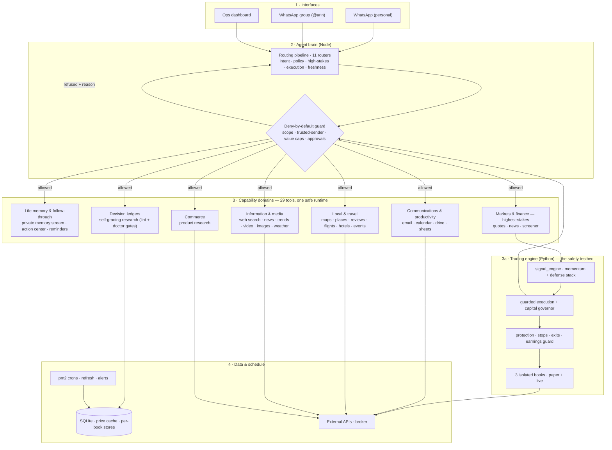

# ARIN — end-to-end architecture

> **Honest scope.** A solo personal system, built and run by one person. Not a shipped product, no external users, and **no trading returns or track record are claimed.** Markets are used only as an adversarial, high-stakes testbed. The public, runnable slice is this repo's guard layer; the full system is a private monorepo.

*A private personal-life assistant. One place that remembers what matters across
health, family, work, travel, money, and information, and can safely act on your
behalf. Mapped from the running code; numbers counted from the repos.*

The engineering problem in one line: **let a language model use 29 tools and take
real actions across someone's whole life without being talked into the wrong
one.** The answer runs through everything below — the model *proposes*, and
deny-by-default, gated code *disposes*.

## The whole thing on one page

## The layers

| Layer | What it does | Real components |
|---|---|---|
| **1 · Interfaces** | Two WhatsApp bridges (personal + a group where `@arin` runs commands) and an ops dashboard. | `scripts/whatsapp*.js`, `scripts/dashboard.py` |
| **2 · Agent brain** | An **11-stage routing pipeline** classifies each request, then a **deny-by-default guard** decides what may run. Every tool call, in every domain, passes the same guard. | `src/routing/*`, `src/policy-engine.js`, `src/capability-registry.js` |
| **3 · Capability domains** | The breadth — 29 tools grouped by life area, one shared safe runtime (see below). | `src/tools/*`, `src/actions/*`, `src/life/*` |
| **3a · Trading engine** | Markets is the *highest-stakes* domain, so it carries the heaviest machinery: signal, guarded execution, and a separate always-on protection layer over 3 isolated books. This is where the safety model was proven first. | `options-momentum/src/**` |
| **4 · Data & schedule** | A ~700MB price cache, per-book stores, JSONL event logs, and cron jobs that refresh data and fire alerts. | `options-momentum/data/*.db`, pm2 crons |

## The capability domains (the breadth)

ARIN is not a trading bot with extras. It is a life assistant, and markets are
one domain among several:

- **Life memory & follow-through** — a private memory stream plus an action center: capture what matters (a promise, a health note, a bill), hold the open loop, and nudge at the right time. `life-ledger`, `action-ledger`.
- **Communications & productivity** — read and draft email, manage calendar, read Drive, build sheets. `gmail`, `email-tools`, `calendar`, `drive`, `sheets`.
- **Local & travel** — directions, places, reviews, restaurants, flights, hotels, trip ideas, events. `maps-directions`, `places-local`, `yelp`, `opentable`, `tripadvisor`, `flights`, `hotels`, `travel-explore`, `events`.
- **Information & media** — live web search, news, trends, how-to video, images, weather. `web-search`, `web-tools`, `serpapi`, `trends`, `youtube`, `images`.
- **Commerce** — product research and comparison. `shopping`.
- **Decision ledgers** — research that writes predictions before the evidence and grades itself in public, behind two gates.
- **Markets & finance** — quotes, market news, a daily screener, and the guarded trading engine (3a).

**One runtime, one guard.** Whether the request is "remind me to call the school
Friday," "best sushi near me," or "rebalance the momentum book," it flows through
the *same* routing pipeline and the *same* deny-by-default guard. Breadth without
a shared safety layer is how assistants go wrong; that shared layer is the point.

## Two real paths, end to end

**A · An everyday-life request — "what's on today, and anything I promised?"**
1. The bridge hands the request to the routing pipeline.
2. The guard grants read-scope for calendar + memory (no write, no spend).
3. Tools pull the calendar and the open loops from the private memory stream.
4. ARIN answers, and nothing acted on the outside world — a read stays a read.

**B · A high-stakes action — a trading rebalance:**
1. `signal_engine` ranks the universe (risk-adjusted momentum + sector cap + inverse-vol).
2. Each proposed order hits the guard: dry-run by default, trusted-sender-only, a confidence floor, a hard max-order-value cap.
3. If it clears, execution places it **per book**, never crossing accounts.
4. A separate always-on monitor attaches stops and watches earnings dates.

Same guard, wildly different stakes — that is the design working.

## How it works — four principles that repeat in every domain

1. **The model proposes; deterministic, gated code disposes.** No LLM output sends an email, books a trip, moves money, or runs git directly. Every real-world action is behind a gate it can't bypass.
2. **Deny-by-default.** Tools, capabilities, and alert kinds are opt-in. New power is registered explicitly or it simply doesn't fire.
3. **Isolate what's catastrophic.** Per-account credentials, stores, and sizing over a shared abstraction — isolation bugs are the game-over failure.
4. **Prove it, don't trust it.** Delivery proof (not exit codes), self-grading research behind two gates, and every incident turned into a regression test.

**Counted from the repos:** 29 tools across 6+ life domains · 16 always-on services · a self-grading research system · a guarded trading engine over 3 isolated books.

*The public, runnable slice of the guard layer is this repo:
[github.com/srinu16it/llm-tool-host](https://github.com/srinu16it/llm-tool-host).*
