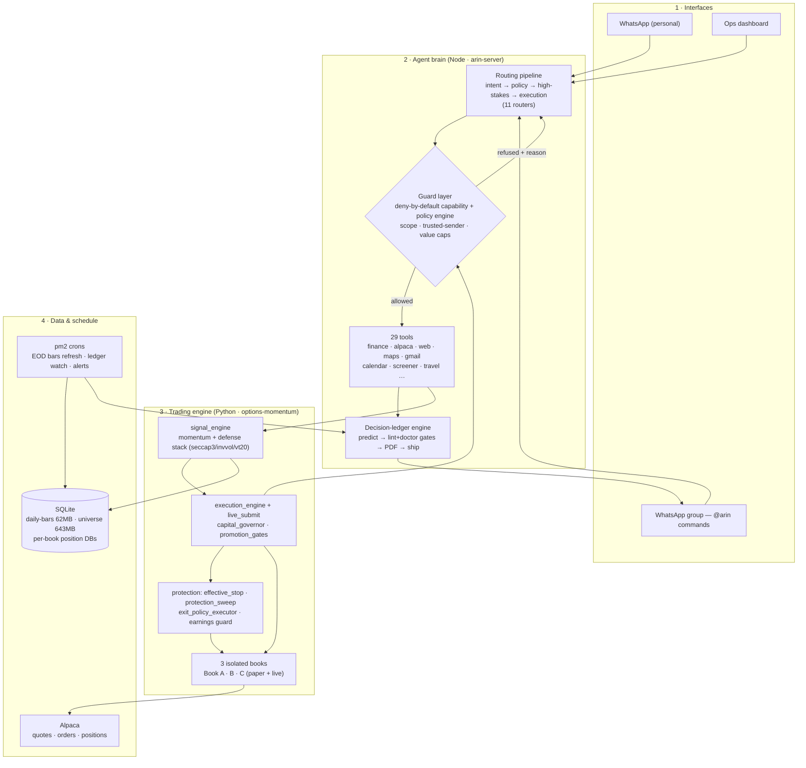

# ARIN — end-to-end architecture

> **Honest scope.** A solo personal system, built and run by one person. Not a shipped product, no external users, and **no trading returns or track record are claimed.** Markets are used only as an adversarial, high-stakes testbed for safety and isolation. The public, runnable slice is this repo’s guard layer; the full system is a private monorepo.

*Mapped from the running code. Numbers below are counted from the repos, not estimated.*

## The whole thing on one page

## The layers, with the real files

| Layer | What it does | Where it lives |
|---|---|---|
| **1 · Interfaces** | Two WhatsApp bridges + a dashboard. The group bridge parses `@arin` commands; anything else goes to the brain. | `scripts/whatsapp-group.js`, `scripts/whatsapp.js`, `scripts/dashboard.py` |
| **2 · Agent brain** | An 11-stage **routing pipeline** classifies each request (intent → policy → high-stakes → execution → freshness → disclosure), then a **deny-by-default guard** decides what may run, then one of **29 tools** executes. | `src/routing/*`, `src/policy-engine.js`, `src/capability-registry.js`, `src/tools/*` |
| **Decision ledgers** | Research that writes predictions *before* the evidence and grades itself. Two gates (lint + 7-check doctor) and a deterministic ship pipeline; the model writes content, code does the irreversible steps. | `options-momentum/scripts/ledger_*.py` |
| **3 · Trading engine** | Momentum signal (now the **defense stack**: seccap3 + invvol + vt20), guarded execution, capital governor, and a separate always-on protection layer (stops, exits, earnings guard). | `options-momentum/src/options_momentum/{signal,execution}_engine.py`, `live_submit.py`, `effective_stop.py`, `protection_sweep.py` |
| **Isolation** | **Three independent books** (A / B / C), paper + live, each with its own credentials, DB, and sizing. Cross-book supervisor watches for drift. | `cross_book.py`, `capital_allocator.py`, per-book `swing-*.db` |
| **4 · Data & schedule** | A ~700MB price cache, per-book position stores, JSONL event logs, and pm2 cron jobs that refresh data and fire alerts on a schedule. Alpaca is the broker. | `options-momentum/data/*.db`, `data/runtime/*.jsonl`, pm2 crons |

**Counted from the repos:** 29 tools · 16 always-on services · 3 books · 43 self-grading ledgers · ~700MB market data.

## Two real paths, end to end

**A · "@arin ledger SYK" (a research request):**
1. Group bridge regex-matches the command — free text never reaches a shell.
2. It spawns a headless agent run, scoped to that one ticker.
3. The agent uses tools (prices, filings, news) to build the analysis.
4. It writes a prediction + standing orders as machine-readable meta.
5. **Two gates** run: lint (doc ↔ meta must agree) + doctor (7 board checks).
6. A deterministic script makes the PDF, commits, pushes, verifies it landed, and delivers to the group. The LLM never touched git.

**B · A trading signal (a market action):**
1. `signal_engine` ranks the universe by risk-adjusted 6-month momentum, applies the sector cap and inverse-vol weights.
2. The proposed order hits the **guard**: dry-run by default, trusted-sender-only, minimum confidence, hard max-order-value cap.
3. If it clears, `live_submit` places it — **per book**, never crossing accounts.
4. A separate always-on monitor attaches protective stops and watches earnings dates. The LLM proposes; gated code disposes.

## How it works — the four principles that repeat everywhere

1. **The model proposes; deterministic, gated code disposes.** No LLM output places an order, runs git, or moves money directly. Every irreversible step is behind a gate it can't bypass.
2. **Deny-by-default.** Capabilities, alert kinds, and tool calls are all opt-in. New power is registered explicitly or it simply doesn't fire.
3. **Isolate what's catastrophic.** Per-account credentials/DBs/sizing over a shared abstraction — isolation bugs are the game-over failure, and duplication is cheap to audit.
4. **Prove it, don't trust it.** Delivery proof (not exit codes), self-grading research behind two gates, and incidents turned into regression tests.

*This is the private full system. The public, runnable slice of the guard layer is [github.com/srinu16it/llm-tool-host](https://github.com/srinu16it/llm-tool-host).*
